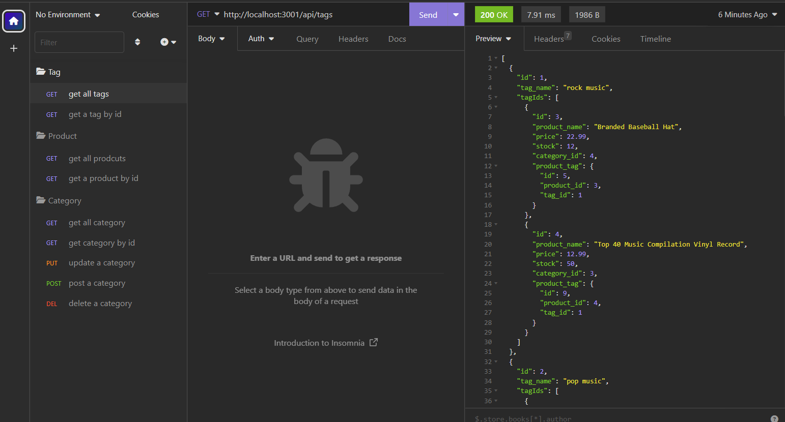

# 13 Object-Relational Mapping (ORM): E-Commerce Back End

## Description

In this task, I built a E-Commerce Back End, and users can use insomnia to use this application and interact with the database. 

In this application, there are 3 models: category, product, and tag. By interacting with it, users can get single one category, product, and tag by id, or all of them. In addtion to the GET request, users can also use the POST, UPDATE, and DELETE request. 

## Screenshots

## Links

* A walkthrough video:
https://drive.google.com/file/d/1F7vVmwFBQ8jPwRmAvH6ccOK_14Nz6bE3/view?usp=sharing

* The URL of the GitHub repository: 
https://github.com/Jiasisi/E-Commerce-Back-End-ORM-

